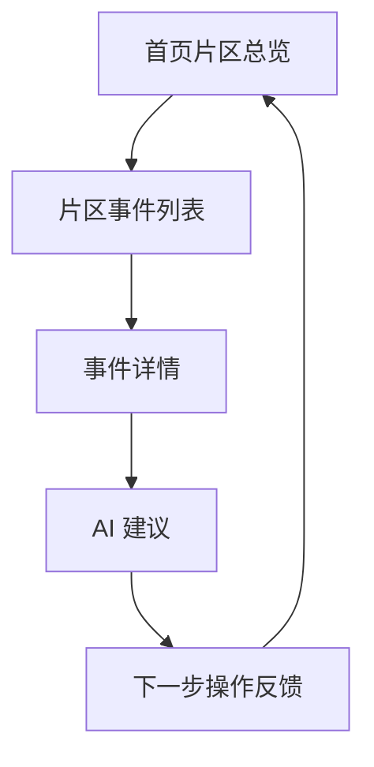

# 页面 / 功能结构图

## 核心页面链路



## 页面功能结构

```text
事件调度与管理看板 MVP 原型
├─ 首页片区总览
│  ├─ 片区运行状态
│  ├─ 异常事件数量
│  ├─ 待处理事件数量
│  ├─ 超时提醒
│  └─ 重点片区入口
├─ 片区事件列表
│  ├─ 事件卡片
│  ├─ 事件类型
│  ├─ 事件位置
│  ├─ 优先级
│  ├─ 当前状态
│  └─ 负责人
├─ 事件详情
│  ├─ 事件基础信息
│  ├─ 所属片区
│  ├─ 负责人
│  ├─ 流转节点
│  ├─ 处理时限
│  └─ 下一步动作
├─ AI 建议
│  ├─ 风险等级
│  ├─ 判断原因
│  ├─ 推荐动作
│  ├─ 推荐资源
│  └─ 人工确认入口
└─ 下一步操作反馈
   ├─ 采纳建议
   ├─ 调整方案
   ├─ 指派负责人
   ├─ 派发资源
   └─ 返回总览
```

## 角色视角对应关系

| 页面 / 功能 | 主要服务角色 | 页面目标 |
| --- | --- | --- |
| 首页片区总览 | 高管层 | 快速判断整体运行状态和异常片区 |
| 片区事件列表 | 调度/片区主管 | 聚焦某个片区内需要处理的事件 |
| 事件详情 | 调度/片区主管 | 明确事件位置、负责人、状态和下一步动作 |
| AI 建议 | 调度/片区主管 | 辅助判断优先级、动作和资源匹配 |
| 下一步操作反馈 | 调度/片区主管 | 完成人工确认，让事件继续流转 |

## 交互说明

原型从首页片区总览开始，先满足高管层对整体状态的判断需求；当发现异常片区后，通过点击片区进入事件列表，再打开具体事件详情。事件详情中嵌入 AI 建议区，提供可解释的调度建议。调度/片区主管根据建议进行确认或调整，形成下一步操作反馈，并最终回到首页查看整体状态是否变化。
