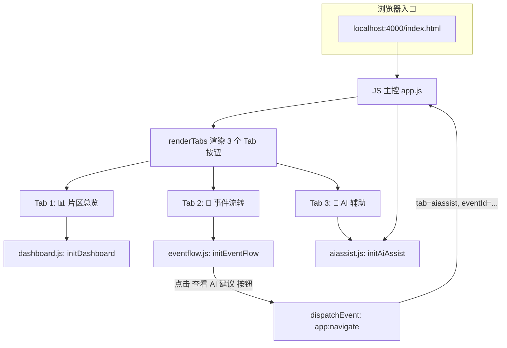
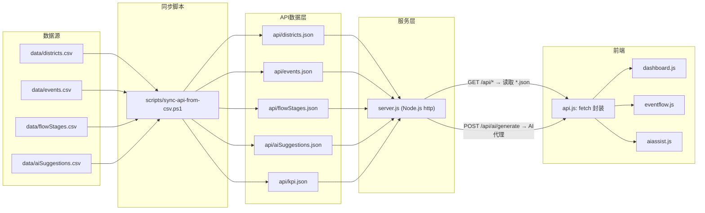
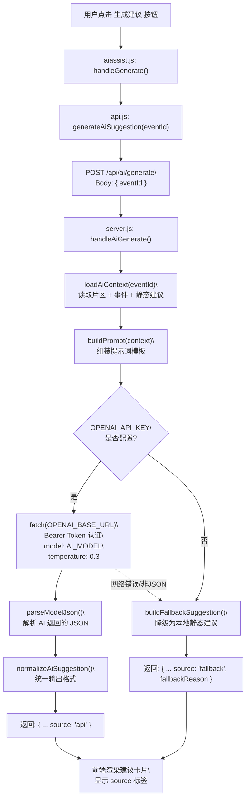

# 一页纸页面/功能结构图 v1.2.0

## 一、Tab 导航与页面路由



**路由机制**：
- 单页应用，通过 `index.html` 中的 `#module-container` 动态渲染
- Tab 切换由 `app.js` 中 `currentTab` 状态驱动，映射到对应模块初始化函数
- 跨模块导航通过 `window.dispatchEvent(new CustomEvent("app:navigate", { detail: { tab, eventId } }))` 实现

---

## 二、数据架构



**数据流说明**：
- CSV 是源数据，由 PowerShell 脚本一次性同步为 `api/*.json`
- Node.js server 按路径映射：`/api/districts` → `api/districts.json`
- 前端 `api.js` 封装 `fetch`，所有模块通过统一函数获取数据
- KPI 聚合数据 (`api/kpi.json`) 由同步脚本从 events 和 districts 统计生成

---

## 三、AI API 调用链



**降级策略**：无 Key、网络异常、模型返回非 JSON 三种情况均自动 fallback，前端显示"fallback"标签和降级原因文字，不白屏。

---

## 四、组件树（按 Tab 展开）

### Tab 1: 📊 片区总览

```text
#module-container
└── panel-wide
    ├── .kpi-bar
    │   ├── .kpi-item × 5（事件总数 / 待处理 / P0紧急 / 超时 / 异常片区）
    │
    ├── section#district-overview
    │   ├── .panel-heading（标题 + 返回总览按钮）
    │   └── .district-grid
    │       └── .district-card × 4
    │           ├── .card-topline（片区名 + 状态标签）
    │           ├── .metric-row（今日事件 / 待处理 / 超时）
    │           └── .meta（可用资源）
    │
    └── section#event-list
        ├── .panel-heading（片区事件列表 / 全部事件列表）
        └── .event-stack
            └── .event-card × N（可筛选）
                ├── .card-topline（事件类型 + 优先级标签 P0/P1/P2）
                ├── .event-meta（状态标签 + 负责人）
                └── .meta（eventId · 位置 · 时限）
```

### Tab 2: 🔄 事件流转

```text
#module-container
├── section#flow-pipeline
│   ├── .panel-heading（标题 + 事件总数）
│   └── .flow-stages
│       └── .flow-node × 5（待派单📋 / 协调中🔄 / 处理中🔧 / 待复核🔍 / 已关闭✅）
│           ├── .flow-icon
│           ├── .flow-label
│           └── .flow-badge（该阶段事件数）
│
└── .flow-two-col
    ├── section#flow-event-list（左侧）
    │   ├── .panel-heading（阶段名 + 事件数）
    │   └── .event-stack
    │       └── .event-card × N（点击选中高亮）
    │
    └── section#flow-detail（右侧）
        ├── .detail-placeholder（未选事件时显示提示）
        └── 选中事件后：
            ├── h3（eventId · 事件类型）
            ├── .flow-mini-bar（迷你流转条，done/current/pending 三态）
            │   └── .flow-mini-step × 5 + flow-mini-arrow 分隔
            ├── .detail-ai-entry（查看 AI 建议入口按钮）
            ├── dl.detail-list（8 个字段：片区/位置/负责人/状态/下一步/时限/上报时间/上报人）
            └── .action-panel（已关闭事件不显示）
                ├── .panel-heading（下一阶段标签）
                ├── .action-hint（推荐动作）
                ├── .action-buttons（确认推进 / 改派他人 / 升级处理）
                └── .action-feedback（临时反馈消息 3 秒消失）
```

### Tab 3: 🤖 AI 辅助

```text
#module-container
├── section#ai-risk
│   ├── .panel-heading（AI Risk Analysis / 风险态势分析）
│   └── .risk-summary
│       └── .risk-cards（四象限）
│           ├── .risk-card.risk-high（高风险未处理数）
│           ├── .risk-card.risk-mid（中风险待确认数）
│           ├── .risk-card.risk-low（低风险数）
│           └── .risk-card.risk-done（已采纳数）
│
└── section#ai-suggestions
    ├── .panel-heading（标题 + 定位事件提示 + 生成建议按钮）
    ├── .ai-focus-empty（无建议时：空状态 + 生成按钮）
    └── .suggestion-grid-detailed
        └── .suggestion-card-full × N
            ├── .suggestion-header
            │   ├── 事件 ID + 类型 · 片区
            │   └── .suggestion-tags（风险等级标签 + 来源标签 api/fallback/静态）
            ├── .suggestion-body
            │   ├── .suggestion-field：推荐动作 + 说明
            │   ├── .suggestion-field：判断原因
            │   ├── .suggestion-field：推荐资源
            │   ├── .suggestion-confidence（置信度进度条 + 百分比）
            │   └── .ai-source-note（fallback 降级原因）
            └── .suggestion-actions（未采纳时）
                ├── 生成建议
                ├── 采纳建议
                ├── 调整方案
                └── 暂不处理
```

---

## 五、角色视角对应关系

| 页面 / 功能 | 主要服务角色 | 页面目标 |
|---|---|---|
| Tab 1 片区总览 | 高管层 | 快速判断整体运行状态，发现异常片区 |
| Tab 2 事件流转（列表+详情）| 调度/片区主管 | 追踪事件流转节点，明确责任人、下一步动作和时限 |
| Tab 2 操作面板 | 调度/片区主管 | 推进事件流转（确认/改派/升级），形成操作反馈 |
| Tab 3 AI 风险态势 | 高管层 + 调度主管 | 全局看清风险分布和已处理进度 |
| Tab 3 AI 建议卡片 | 调度/片区主管 | 辅助判断优先级、推荐动作和资源匹配 |
| Tab 3 生成建议（v1.2.0）| 调度/片区主管 | 对无预置建议的事件实时请求 AI 判断 |
| 跨模块导航（事件详情→AI）| 调度/片区主管 | 无缝串联"看事件→看建议→做决策"流程 |
